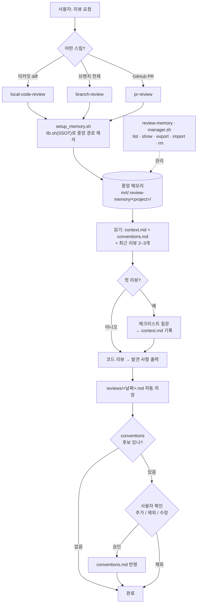

# 코드 리뷰 스킬 모음

여러 에이전트(Claude Code · Codex · Gemini CLI · Copilot CLI)에서 공용으로 쓰는 코드 리뷰
스킬 저장소. 모든 리뷰 스킬이 프로젝트별
**리뷰 메모리**를 공유해서, 리뷰를 거듭할수록 그 프로젝트에 특화된 리뷰어가 되는 것이 핵심이다.
메모리는 대상 프로젝트가 아니라 **이 저장소 한 곳**(`mrt/.review-memory/<project>/`)에 모인다.

## 스킬 목록

스킬은 전부 [`skills/`](skills/) 아래에 있다.

| 스킬 | 대상 | 언제 쓰나 |
|------|------|-----------|
| [`local-code-review`](skills/local-code-review/SKILL.md) | 미커밋 변경 (working diff) | 커밋/푸시 전에 "내 변경사항 봐줘", "커밋 전에 리뷰해줘" |
| [`branch-review`](skills/branch-review/SKILL.md) | 브랜치 전체 (base 브랜치의 merge-base 기준, 커밋 + 미커밋) | "main 대비 뭐가 바뀌었는지 리뷰해줘", "브랜치 전체 심각도별로 봐줘" |
| [`pr-review`](skills/pr-review/SKILL.md) | GitHub PR | PR 번호/URL로 "이 PR 리뷰해줘" — 복사해서 달 수 있는 추천 코멘트까지 생성 |
| [`pr-write`](skills/pr-write/SKILL.md) | PR 작성 (제목 + 본문) | "PR 작성해줘/올려줘", "PR 제목·본문 다듬어줘" — 커밋을 읽어 정형 PR을 만들고 gh로 생성/수정 (작성 전용, 리뷰 아님) |
| [`review-memory`](skills/review-memory/SKILL.md) | 리뷰 메모리 관리 | 메모리 내보내기/가져오기/조회, 리뷰 컨텍스트 사전 등록. 공용 스크립트도 여기에 |
| [`changelog`](skills/changelog/SKILL.md) | 이 저장소의 변경 이력 | "체인지로그 갱신해줘", "버전 올려줘/릴리스" — 커밋을 쉬운 문장으로 기록 + SemVer 태그 |

### 출력 형식

- 세 리뷰 스킬 모두 발견 사항을 **항목별 블록**(클릭 가능한 `파일:라인` 위치 + 문제 코드 + 수정 제안)으로 출력한다.
- `branch-review`는 심각도 **🔴 High / 🟡 Medium / 🟢 Low** 3단계로 분류하고 요약에 건수를 표기한다.
- `local-code-review`는 🔴 커밋 전 수정 / 🟡 권장 / 💬 확인 필요, `pr-review`는 🔴 반드시 수정 / 🟡 권장 / 💬 질문 구조를 쓴다.
- 수정 적용·GitHub 코멘트 게시는 사용자가 명시적으로 요청할 때만 한다. 기본은 보고.

## 워크플로우



- 모든 리뷰는 **중앙 메모리를 읽고 시작**한다 — 과거 패턴·컨벤션·컨텍스트가 리뷰 관점에 반영된다.
- 개별 리뷰 로그(`reviews/<날짜>.md`)는 자동 저장하지만, **`conventions.md`에 학습을 쌓는 것은 사용자 확인을 거친다**(노이즈 방지).
- 대상 프로젝트에는 아무 파일도 만들지 않는다 — 메모리는 전부 이 저장소(mrt)에 모인다.

## 리뷰 메모리 구조

모든 프로젝트의 리뷰 메모리는 이 저장소 안 한 곳에 모인다. 대상 프로젝트에는 아무 파일도
만들지 않으므로 각 repo에서 무시 설정을 할 필요가 없다. 중앙 폴더는 이 저장소의 `.gitignore`로
무시되어 커밋되지 않는다.

```
mrt/.review-memory/              # .gitignore로 무시됨 → 커밋 안 됨
├── <project>/                   # 대상 프로젝트의 git 루트 basename  ← repo 공유 계층
│   ├── .origin                  # 원본 프로젝트 절대경로 (목록/추적용)
│   ├── conventions.md           # 반복 패턴·컨벤션 — 리뷰 끝에 사용자 확인 후 누적
│   ├── context.md               # 사용자가 미리 등록하는 배경/중점 사항 (review-memory 스킬로 관리)
│   ├── reviews/
│   │   └── <날짜>-<대상>.md     # 예: 2026-06-12-pr-123.md, 2026-06-12-branch-feat-login.md
│   └── scopes/                  # (모노레포 전용, 필요할 때만 생김) 패키지별 계층
│       └── <패키지>/            # 예: ui, core, web — 각자 conventions.md·context.md·reviews/
└── <다른 프로젝트>/ …
```

- 경로 규칙은 [`scripts/lib.sh`](skills/review-memory/scripts/lib.sh) 한 곳(SSOT)에 있다.
- 여러 프로젝트 메모리는 PATH 런처 `mrt-review`(→ [`manager.sh`](skills/review-memory/scripts/manager.sh))로 한 번에 다룬다: `list` · `show` · `path` · `export` · `import` · `rm`.
- **모노레포**는 패키지마다 컨벤션이 달라서, repo 공유 계층과 패키지(`scopes/<패키지>/`) 계층으로 나눈다. 리뷰 스킬이 변경 파일 경로로 패키지를 자동 판별해 양쪽을 함께 읽는다. 단일 repo 프로젝트는 `scopes/`가 생기지 않아 기존과 동일하다.

모든 리뷰는 시작할 때 `conventions.md` + `context.md` + 최근 리뷰 2~3개를 읽고,
끝나면 결과를 저장한다. PR 리뷰에서 발견된 패턴이 로컬/브랜치 리뷰에도 반영되고,
그 반대도 마찬가지다.

## 설치

여러 에이전트에 한 번에 설치한다 (정본 1개 + 링크 N개):

```bash
bash install.sh
```

설치되는 것:

- `~/.claude/skills/<name>` — Claude Code
- `~/.agents/skills/<name>` — Codex · Gemini CLI · Copilot CLI 공통 발견 경로
- `~/.local/bin/mrt-review` — 스킬 본문이 호출하는 PATH 런처 (메모리 스크립트 단일 진입점)

`install.sh`는 멱등이라 재실행해도 안전하다. 스킬 본문은 절대경로 대신 `mrt-review`만
호출하고, 스크립트는 설치 위치와 무관하게 동작한다(`scripts/lib.sh`가 mrt 루트를 자동 탐색,
`$MRT_HOME`로 override 가능). 지시파일은 `AGENTS.md`가 정본이며 `CLAUDE.md`·`GEMINI.md`는
그 심링크다.

> `~/.local/bin`이 PATH에 없으면 `export PATH="$HOME/.local/bin:$PATH"`를 shell rc에 추가한다.

## 버전 관리

이 저장소의 변경 이력은 [`CHANGELOG.md`](CHANGELOG.md)에 [Keep a Changelog](https://keepachangelog.com/ko/1.1.0/) + [SemVer](https://semver.org/lang/ko/) 형식으로,
**개발자가 아니어도 이해할 수 있는 쉬운 문장**으로 기록된다. [`changelog`](skills/changelog/SKILL.md) 스킬이 커밋을
`[Unreleased]`에 기록하고(add), 릴리스 때 버전 확정 + `vX.Y.Z` 태그를 만든다(release).

Claude Code에서는 커밋 훅([`.claude/settings.json`](.claude/settings.json) → [`scripts/hooks/`](scripts/hooks/))이 자동으로 돈다:

- `changelog-on-commit.sh` — 커밋되면 변경을 `CHANGELOG.md`에 기록하도록 신호.
- `doc-freshness.sh` — 스킬을 추가/변경했는데 `README.md`·`AGENTS.md`가 안 따라왔으면 문서 갱신을 알림.

훅은 Claude Code 전용이라, 다른 에이전트에서는 `changelog` 스킬을 직접 부르면 밀린 커밋을 따라잡는다.

## 기타

- [`review-skills-workspace/`](review-skills-workspace/) — 스킬 개발 시 사용한 평가(eval) 픽스처와 결과물. 스킬 동작과는 무관하다.
